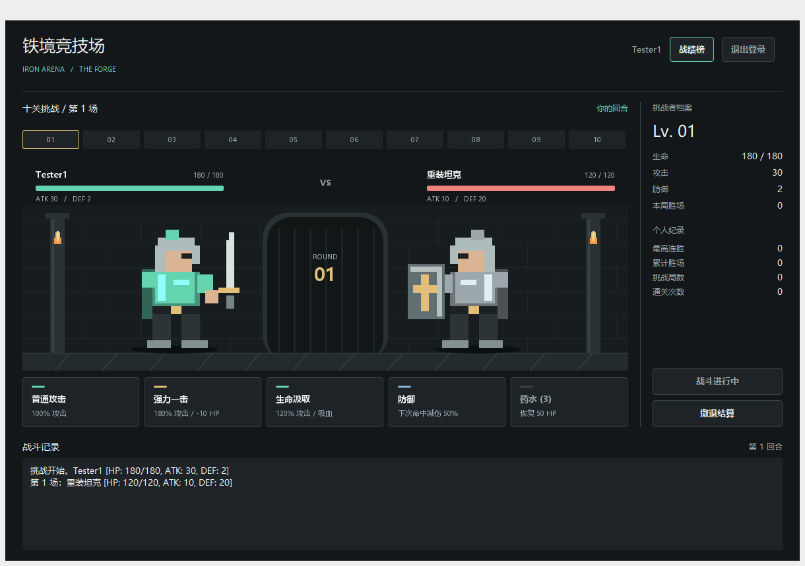

# 铁境竞技场 / Iron Arena

基于原始 Java 文字格斗 demo 完善的 Swing 桌面回合制游戏。1.2.0「绯幕剧场」采用酒红幕布、古金纹饰与冷色战斗光效，包含职业远征、战后成长和原生桌面联机。免安装 EXE 自带 Java 与联机服务，玩家无需打开浏览器。保留经典控制台入口。



桌面界面包含三职业原创赛璐璐风格立绘、剧场舞台、菱形关卡轨道和票券式技能按钮。登录、角色选择、奖励、设置、战绩榜与联机窗口使用统一的剧场主题；字体、图标和音频全部随包提供，可离线使用。

大厅与战斗分别播放原创合成配乐，按钮悬停、点击、出招和胜负有声音反馈。右上角设置可分别调节音乐、音效和动态效果；保存到 `data/presentation.properties`，取消会恢复原值。主窗口最小化时暂停背景音乐，没有可用音频设备时仍可正常游玩。配乐为程序合成音频，角色与舞台由 Java2D 绘制。素材来源和许可见 [资源说明](fightinggame/resources/CREDITS.md)。

## 启动

Windows 下双击根目录 `start.bat`，或者运行：

```powershell
.\run.ps1
```

源码构建需要 JDK 17+ 和 Maven 3.9+。脚本查找 `JAVA_HOME`、`.tools/jdk` 和 PATH 中的 `javac`，先构建并测试联机服务，再编译桌面程序。桌面 JSON 依赖从服务的构建产物中提取，版本与服务保持一致。可以通过 `-JdkPath` 指定 JDK；Maven 可以放入 PATH 或 `.tools/maven`。

```powershell
.\run.ps1 -Console    # 控制台版
.\run.ps1 -Test       # 战斗、存储、字体、立绘、音频和设置测试
.\run.ps1 -GuiTest    # 打开真实窗口，测试交互并生成截图
.\run.ps1 -NetworkTest # 原生开房、双客户端对战、重连、再战和服务关闭
.\run.ps1 -BuildOnly  # 只编译和打包
.\run.ps1 -Test -ReuseServer # 本地迭代时复用已构建的联机服务
```

如果 PowerShell 阻止脚本执行，可使用 `start.bat`，或单次执行：

```powershell
powershell.exe -NoProfile -ExecutionPolicy Bypass -File .\run.ps1
```

已编译的 JAR 也可以在带图形桌面的 Java 17+ 环境中运行：

```text
java -jar build/fightinggame.jar
java -jar build/fightinggame.jar --console
java -Dfightinggame.dataDir=D:/arena-data -jar build/fightinggame.jar
```

IDE 中须将 `build/lib` 下的三个 Jackson JAR 加入桌面模块依赖，并将 `fightinggame/resources` 标记为资源目录。建议使用脚本运行，确保 `build/server` 和 `build/lib` 同时存在。不要运行仓库原有 `out/production` 中的旧 `.class` 文件；分发时也不能只复制主 JAR。

## Windows 免安装版

已打包的版本位于 `dist/IronArena-1.2.0-windows-x64.zip`。完整解压后，双击目录中的 `IronArena.exe` 即可运行；玩家无需安装 Java。`app` 和 `runtime` 文件夹必须与 EXE 一起保留。旧版本不会被覆盖。

免安装版将账号和战绩保存在 EXE 旁边的 `data` 文件夹，不依赖启动时的工作目录。移动游戏时可以一起移动存档；更新版本时先关闭游戏，再将旧版 `data` 复制到新目录。请解压到有写入权限的位置。分发包不包含开发目录的账号或战绩。

开发者重新打包需要完整的 Windows x64 JDK 21+，包括 `jpackage`、`jlink` 和 `jmods`：

```powershell
powershell.exe -NoProfile -ExecutionPolicy Bypass -File .\package.ps1 -Version 1.2.0
# 也可以明确指定完整 JDK：
.\package.ps1 -Version 1.2.0 -JdkPath 'C:\Java\jdk-21'
```

脚本先构建服务和桌面程序，再生成带完整模块的 Java 运行环境、EXE 目录、ZIP 和 SHA-256 校验文件。保留完整模块以支持桌面、WebSocket、TLS 和 Spring 内置服务。同版本输出已存在时会停止，避免覆盖已有游戏或存档。`dist` 和构建工具位于 Git 忽略范围，源码仓库不携带大型二进制发布包。

发布包验证：`powershell.exe -NoProfile -ExecutionPolicy Bypass -File .\packaging\test-portable.ps1`。测试在包含中文和空格的路径下解压 ZIP，清除子进程的 Java 环境配置，检查 EXE 的账号、结算、GUI、实例锁和退出，再使用包内运行时验证原生开房、双人对战、断线恢复和关闭服务。测试账号只存在于临时副本中。

## 桌面联机

在两台电脑上打开游戏，点击右上方“联机对战”。房主点击“创建房间”，将显示的 IP:端口发给另一位玩家；另一位输入地址后点击“连接”。双方入席并准备后开始战斗。房主关闭联机窗口时内置服务随之关闭；启动失败可查看 `data/host-端口.log`，端口占用时可另选端口。

Windows 防火墙需允许专用网络上的入站连接。多网卡或 VPN 环境请选用两台电脑互通的局域网 IPv4 地址。同机测试请复制成两个游戏目录，分别使用各自存档。当前每个服务只有一个竞技场，支持旁观、认输、再战与30秒重连，不含公网匹配和自动网络穿透。联机统一属性与五种基础技能，职业大招和奖励成长属于离线模式。

## WebSocket 联机原型

独立的 [multiplayer 项目](multiplayer/README.md) 提供权威对战服务，桌面客户端与网页客户端可以进入同一对局。后端维护血量、技能、回合和胜负；状态仅保存在服务内存中。网页回声和共享画板仍是独立练习，不是正式游戏入口。

从仓库根目录运行 `powershell.exe -NoProfile -ExecutionPolicy Bypass -File .\multiplayer\run.ps1`，随后打开 <http://127.0.0.1:8080/duel.html>。需要 JDK 17+ 和 Maven 3.9+。详细约定见 [联机对战协议](multiplayer/DUEL_PROTOCOL.md)。回声测试和共享画板保留为独立的通信练习，不作为最终游戏玩法。

## 玩法

- **十关挑战**：连续击败十个对手，第十关为守关者。
- **职业远征（桌面版）**：铁卫（190生命/22攻击/5防御）、狂刃（140/42/0）、灵术师（180/30/2），分别拥有盾牌、双刃与法杖外观。每次有效基础行动获得25能量，100能量可施放大招；大招消耗回合并推进汲取冷却，新战斗能量清零。
- **职业大招**：铁卫140%攻击、恢复45生命并防御；狂刃300%攻击；灵术师180%攻击、恢复40生命。攻击仍扣除对方防御，治疗不超过生命上限。
- **战后奖励（桌面版）**：每次非最终关胜利后三选一，可获得攻击+4、防御+2、生命上限及当前生命+20、补充药水并恢复15生命、或恢复65生命。选择后进入下一关，本局强化列表可在侧栏悬停查看。
- **敌方意图与精英**：桌面版显示下一次敌方行动。远征第3、6、9关为精英（额外40生命、3攻击、2防御），四个区域随进度变换场景色调。无尽模式每三关出现精英。
- **无尽试炼**：保留原 demo 的连续挑战方式，敌人随胜场成长。
- **属性分配**：共20点，基础生命100、攻击10、防御0；每点分别增加10生命、2攻击或1防御。桌面可选职业预设或自定义，剩余点数自动投入防御；控制台保留均衡与猛攻预设。
- **局内成长**：每3胜生命上限与当前生命增加30、攻击增加5、防御增加3，补充1瓶药水，上限3瓶。非最终关胜利后随机恢复20-40生命，提示显示实际回复量。
- **结算**：战斗中可撤退，胜利后可继续或结束；失败或通关后可以再来一局。正常关闭窗口会询问是否结算当前挑战。

| 行动 | 规则 |
| --- | --- |
| 普通攻击 | 攻击减防御，最低1点伤害 |
| 强力一击 | 消耗10生命，180%攻击力减防御；当前生命必须大于10 |
| 生命汲取 | 120%攻击力减防御，回复实际伤害的50%，向下取整且至少1点；使用后间隔2个有效回合 |
| 防御 | 下一次命中伤害减半，最低1点；多段攻击只抵挡第一段，不叠加 |
| 治疗药水 | 回复最多50生命；满血或没有药水时不能使用；使用会消耗回合 |

敌人保留战士、刺客、坦克和法师四种类型，分别使用猛击、两段攻击、防御姿态和火球术。敌方每回合有50%概率使用技能。敌人被击败后不会继续反击。技能冷却和防御状态会在新一场战斗时重置。

## 账号与存档

- 可直接以游客身份游玩，游客战绩不保存。
- 用户名为3-16位字母数字，至少包含一个字母，区分大小写；密码为6-64位字母数字，必须同时包含两者。
- 注册账号后保存挑战局数、累计胜场、最高连胜和十关通关次数；游戏内可查看本地战绩榜。
- 存档默认位于工作目录的 `data/accounts.properties`。密码使用独立随机盐与 PBKDF2-HMAC-SHA256 摘要保存，不写入明文密码。
- 保存先写临时文件，再替换目标文件；文件系统支持时使用原子替换。存档损坏会报告错误并保留原文件；同一数据目录限制为一个运行实例。
- 当前保存的是账号与已结算战绩，**不支持恢复未完成的一局**。强制结束进程、断电或直接关闭控制台，可能丢失本局战绩。
- 这是离线单机存档，不提供联网认证、找回密码或防作弊服务。

## 代码结构

```text
fightinggame/src/com/itheima/
  App.java                  应用入口、存档目录与实例锁
  doman/                    角色、敌人、玩家与用户模型
  game/Battle.java          单场战斗、行动合法性、冷却与敌方行动
  game/GameSession.java     挑战状态、胜场、成长、通关与结算
  game/Encounters.java      敌人生成与难度成长
  storage/                  密码摘要、本地账号和战绩存储
  ui/GameFrame.java         Swing 桌面界面与账号对话框
  ui/ArenaPanel.java        战斗舞台、血条、待机与技能特效
  ui/GameArt.java           原创剧场场景与三职业角色绘制
  ui/GameTheme.java         主窗口与弹窗的统一主题
  ui/GameButton.java        技能说明、悬停和键盘焦点状态
  ui/GameDialog.java        统一弹窗、标题栏、关闭和 Escape
  ui/GameAudio.java         异步音频设备、场景音乐与交互音效
  ui/SettingsDialog.java    音量、动态效果与设置保存
  ui/UiAssets.java          随包字体和 Lucide 图标加载
  ui/ChallengeTrack.java    十关与无尽模式的进度显示
  ui/ConsoleInput.java      可重试输入与 EOF 处理
  ui/Login.java             控制台账号菜单
  ui/FightingGame.java      控制台游戏流程
fightinggame/test/com/itheima/
  GameTests.java            核心回归测试
  GuiSmokeTest.java         桌面交互与布局检查
  ui/UiResourceTests.java   字体、角色、音频及设置资源检查
```

保留原来的 `doman` 包名。桌面联网使用 JDK HttpClient 和 Jackson JSON，`net/LocalServer` 管理随包分发的 Spring Boot 服务进程，`ui/OnlineDialog` 显示服务器状态。角色与场景通过 Java2D 绘制，无需联网加载美术资源。单机账号与联机临时席位彼此独立，联机对局不计入本地战绩。

原始代码目的、缺陷和改动说明见 [项目分析](docs/PROJECT_ANALYSIS.md)。
